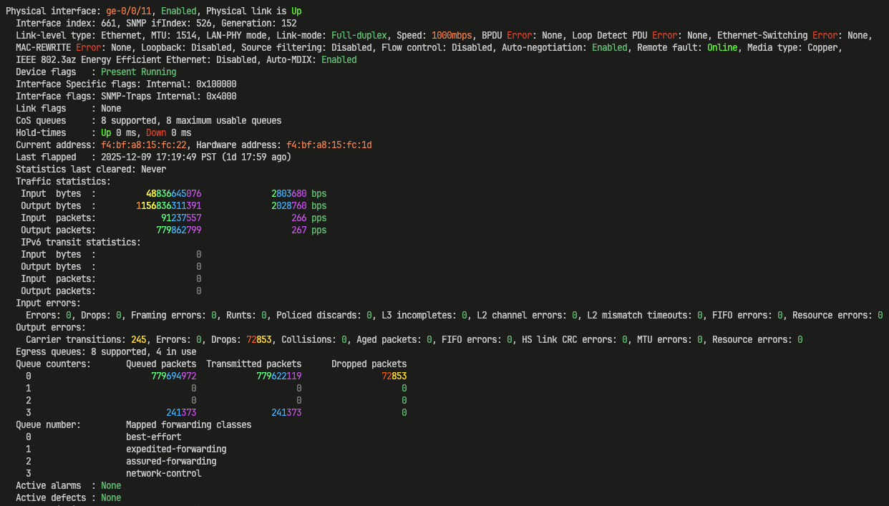
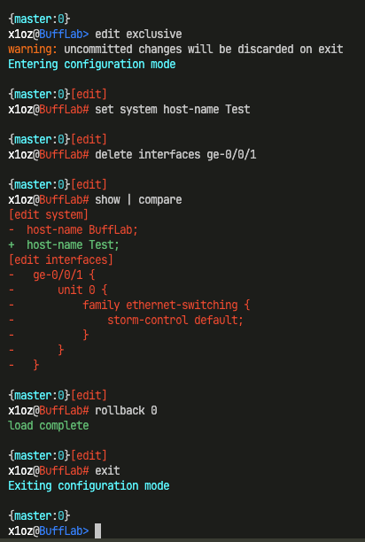

# RainbowTerm

Context-aware terminal colorizer with magnitude spectrum visualization for network device output.


[](https://crates.io/crates/rainbowterm)


> **📸 View Screenshots:** Visit the [GitHub repository](https://github.com/Legendberg/rainbowterm#screenshots) to see the dual spectrum coloring system in action!

## Screenshots

### Dual Spectrum Coloring in Action

*Juniper interface output showing dual spectrum: neutral colors for traffic stats, warm colors for errors*

### Configuration Diff Highlighting

*JunOS configuration diff with syntax highlighting*

## Overview

RainbowTerm is a high-performance Rust-based terminal colorizer designed for network engineers. It provides intelligent syntax highlighting for network device output with advanced features like dual magnitude spectrum visualization (neutral vs. error-based) and context-aware coloring.

## ✨ Key Features

### 🌈 Dual Spectrum Coloring System

RainbowTerm uses **context-aware coloring** with two distinct spectrum systems:

#### Neutral Spectrum (Cool Colors) - Informational Magnitude
For traffic counters, packet counts, and other metrics where bigger isn't bad:

```
Input bytes: 1298458             # Green → Blue → Purple (millions)
Output packets: 1234567890       # Orange → Yellow → Green → Blue → Purple (billions)
Input bytes: 2342779625172       # Orange → Yellow → Green → Blue → Purple (trillions)
Input bytes: 0                   # Gray (idle)
```

- **Rightmost 3 digits**: Purple (base color)
- **Next group (thousands)**: Blue → Purple
- **Millions**: Green → Blue → Purple
- **Billions**: Yellow → Green → Blue → Purple
- **Trillions+**: Orange → Yellow → Green → Blue → Purple
- **Zero**: Gray (idle/no traffic)

#### Error Spectrum (Warm Colors) - Severity-Based Problems
For errors, drops, and problems where bigger IS bad:

```
Errors: 724                      # Yellow (minor - hundreds)
Drops: 1750520                   # Orange → Yellow (moderate - millions)
Errors: 1234567890               # Magenta → Dark Red → Crimson → Yellow (billions)
Errors: 0                        # Green (healthy - no errors!)
```

- **Rightmost 3 digits**: Yellow (base color)
- **Thousands**: Orange → Yellow
- **Ten thousands**: Red → Orange → Yellow
- **Hundred thousands**: Dark Red → Red → Orange → Yellow
- **Millions**: Crimson → Dark Red → Red → Orange → Yellow
- **Billions+**: Magenta/Violet → Crimson → Dark Red → Red → Orange → Yellow
- **Zero errors**: Green (healthy state!)

**Same number, different meaning, different color** - The philosophy behind context-aware coloring.

### 🔍 Automatic Profile Detection

RainbowTerm automatically detects the correct profile based on:
- **Banner/MOTD content** (e.g., "Versa FlexVNF", "JUNOS", "Cisco IOS")
- **CLI prompts** (e.g., `user@hostname>`, `hostname#`)
- **Interface naming patterns** (e.g., `ge-0/0/0`, `vni-0/2`, `GigabitEthernet0/1`)
- **Configurable hostname prefixes** (e.g., `jr`, `vr`, `cs`)

No flags needed - just pipe and go:
```bash
ssh router | rt          # Auto-detects from banner/prompt
cat output.txt | rt      # Auto-detects from content
```

For non-interactive `ssh host "show ..."` whose output contains no banner or
prompt, pass the hostname explicitly so `[hostname_prefixes]` rules can fire:

```bash
ssh js0391-mdf-2-b "show version" | rt --hostname js0391-mdf-2-b
# or, for shell wrappers:
ssh js0391-mdf-2-b "show version" | RT_HOSTNAME=js0391-mdf-2-b rt
```

### 🔧 Network Protocol Support

#### Juniper JunOS
- ✅ Interface names by speed (ge, xe, et, mge, vcp, ae)
- ✅ BGP states (Established/Idle)
- ✅ OSPF states (Full/Down)
- ✅ STP states (FWD/BLK) and roles (DESG/DIS)
- ✅ STP port costs with quality indicators
- ✅ Physical link status (Up/Down)
- ✅ Duplex modes (Full-duplex/Half-duplex)
- ✅ Log severity levels (Critical/Warning/Info)
- ✅ Active alarms and defects
- ✅ Routing table markers (* and >)
- ✅ Configuration diff output (+/-/!)

#### Versa SD-WAN
- ✅ Interface types (eth, vni, tvi, ptvi, dtvi)
- ✅ VRF coloring (Control-VR, LAN-VR, Transport-VR)
- ✅ WAN link identifiers (WAN1, WAN2, WAN3)
- ✅ SD-WAN session details (natted, sdwan, offload)
- ✅ SLA metrics (delay, jitter, loss)
- ✅ LLDP neighbor information
- ✅ Operational/configuration mode prompts
- ✅ Branch/site naming patterns

#### Cisco IOS/IOS-XE/NX-OS
- ✅ Interface names (GigabitEthernet, TenGigabitEthernet, etc.)
- ✅ BGP/OSPF states
- ✅ STP states and roles
- ✅ VTP/VLAN information

#### Generic Patterns
- ✅ IPv4 addresses
- ✅ MAC addresses (colon and dot formats)
- ✅ Serial numbers and model numbers
- ✅ Status keywords (up/down, error/warning)
- ✅ Packet/byte counters with magnitude spectrum

### 🎯 Context-Aware Coloring

Multi-line state machine tracks context across output:
- Interface state (up/down) affects duplex coloring
- Half-duplex on UP link = red warning
- Half-duplex on DOWN link = gray (irrelevant)

### ⚙️ Advanced Features

- **Group-based coloring**: Different colors for each regex capture group
- **Priority system**: Fine-grained control over pattern precedence
- **Profile inheritance**: Extend base patterns with vendor-specific rules
- **TOML configuration**: Human-readable, version-controllable config

## 🚀 Installation

Choose your platform:

- [macOS / Linux](#macos--linux)
- [Windows](#windows)

---

### macOS / Linux

**Step 1: Install Rust**

Using rustup (recommended):

```bash
curl --proto '=https' --tlsv1.2 -sSf https://sh.rustup.rs | sh
```

After installation, restart your terminal or run `source ~/.cargo/env`.

<details>
<summary>Alternative: Homebrew (macOS) or system package manager (Linux)</summary>

**Homebrew (macOS):**

```bash
brew install rust
```

> **Important:** Homebrew doesn't add Cargo to your PATH automatically. Run:
>
> ```bash
> # For zsh (default on macOS)
> echo 'export PATH="$HOME/.cargo/bin:$PATH"' >> ~/.zshrc && source ~/.zshrc
>
> # For bash
> echo 'export PATH="$HOME/.cargo/bin:$PATH"' >> ~/.bashrc && source ~/.bashrc
> ```

**Linux package managers:**

```bash
# Debian/Ubuntu
sudo apt install cargo

# Fedora
sudo dnf install cargo

# Arch
sudo pacman -S rust
```

> **Note:** System packages may be older versions. If you encounter build issues, use rustup instead.

</details>

**Step 2: Install RainbowTerm**

```bash
cargo install rainbowterm
```

**Step 3: Verify installation**

```bash
rt --version
```

You're done! Config is created automatically on first run.

---

### Windows

Windows requires additional setup for compiling Rust programs and for interactive SSH sessions.

**Step 1: Install Git for Windows**

Required for Git Bash, which supports interactive SSH sessions (PowerShell does not).

```powershell
winget install Git.Git
```

Or download from [git-scm.com](https://git-scm.com/download/win).

**Step 2: Install Visual Studio Build Tools**

Required for compiling Rust programs.

```powershell
winget install Microsoft.VisualStudio.2022.BuildTools --override "--wait --passive --add Microsoft.VisualStudio.Workload.VCTools --includeRecommended"
```

Or download from [Visual Studio Build Tools](https://visualstudio.microsoft.com/visual-cpp-build-tools/) and select "Desktop development with C++".

**Step 3: Install Rust**

```powershell
winget install Rustlang.Rustup
```

Or download from [rustup.rs](https://rustup.rs/).

**Step 4: Restart your terminal**, then verify Rust is installed:

```powershell
cargo --version
```

**Step 5: Install RainbowTerm**

```powershell
cargo install rainbowterm
```

**Step 6: Add Cargo to your PATH** (if `rt` command is not found):

```powershell
# Check if rt is installed
ls $env:USERPROFILE\.cargo\bin\rt.exe

# Add to PATH permanently
[Environment]::SetEnvironmentVariable("Path", $env:Path + ";$env:USERPROFILE\.cargo\bin", "User")
```

Restart your terminal after updating the PATH.

**Step 7: Add Git Bash to Windows Terminal**

> **Note:** If you installed Git via the GUI installer (not winget), Git Bash may already appear in Windows Terminal. Skip to step 8 if it's there.

Run these commands in PowerShell to add Git Bash as a profile:

```powershell
$settingsPath = "$env:LOCALAPPDATA\Packages\Microsoft.WindowsTerminal_8wekyb3d8bbwe\LocalState\settings.json"
$settings = Get-Content $settingsPath | ConvertFrom-Json

$gitBashProfile = @{
    name = "Git Bash"
    commandline = "C:\\Program Files\\Git\\bin\\bash.exe"
    icon = "C:\\Program Files\\Git\\mingw64\\share\\git\\git-for-windows.ico"
    startingDirectory = "%USERPROFILE%"
    guid = "{" + [guid]::NewGuid().ToString() + "}"
}

$settings.profiles.list = @($settings.profiles.list) + $gitBashProfile
$settings | ConvertTo-Json -Depth 100 | Set-Content $settingsPath
```

**Step 8: Use Git Bash for interactive SSH**

1. Open Windows Terminal
2. Click the dropdown (▼) next to the tab and select **Git Bash**
3. Run: `ssh <remote-host> | rt`

Example:

```bash
ssh admin@192.168.1.1 | rt
```

---

### From Source

```bash
# Clone the repository
git clone https://github.com/Legendberg/rainbowterm.git
cd rainbowterm

# Build and install
cargo install --path .
```

### Requirements

- Rust 1.70+ (for building)
- macOS, Linux, WSL2, or Windows (with Git Bash for interactive SSH)

## 📖 Usage

### Shell Integration (Recommended)

Setup automatic SSH colorization - no `| rt` needed:

```bash
rt init            # Preview what will be installed
rt init --install  # Install to your shell config
```

This adds a shell function that automatically pipes SSH through RainbowTerm:
```bash
ssh router         # Automatically colorized!
```

### Basic Usage

```bash
# Pipe any command through RainbowTerm (auto-detects profile)
ssh router | rt

# Use with specific profile (skip auto-detection)
cat output.txt | rt --profile juniper

# Disable auto-detection, use default profile from config
cat output.txt | rt --no-auto-detect

# Disable context awareness
tail -f /var/log/messages | rt --no-context

# Preserve ANSI codes from input (default: stripped for cleaner matching)
cat pre-colored.txt | rt --preserve-ansi

# List available profiles
rt --list-profiles
```

### Interactive Linux/Unix shells

rt detects interactive shell sessions (via OS name in the banner or a
`user@host:path$` bash/zsh prompt) and switches to ANSI-preserve mode so
`clear`, readline backspace redraw, and `ls --color` keep working. Detection
is mid-stream and sticky — once rt sees a shell signal, it preserves ANSI for
the rest of the session. Useful for corporate jumpboxes that scrub OS
identifiers from the SSH banner, leaving only a PS1 to go on.

### Windows Note

For interactive SSH sessions on Windows, use **Git Bash** (see [Windows installation](#windows) above). Non-interactive commands work in PowerShell:

```powershell
ssh router "show version" | rt
```

### Testing Profiles

Comprehensive test files are included for each vendor:

```bash
# Test Juniper profile
cat tests/networking/juniper/common/sample.txt | rt --profile juniper

# Test Cisco profile
cat tests/networking/cisco/ios/sample.txt | rt --profile cisco

# Run integration tests
cargo test --test integration_tests

# Run all tests (unit + integration)
cargo test
```

Test files include realistic output from various commands: interfaces, BGP, OSPF, STP, logging, and more.

### Real-World Example: Context-Aware Dual Spectrum

Same output, different colors based on context:

```
Physical interface: ge-0/0/0, Enabled, Physical link is Up
  
  Traffic statistics (NEUTRAL SPECTRUM - cool colors):
   Input  bytes  :              1298458                    0 bps
   Output bytes  :            909181029                32112 bps
  
  Input errors (ERROR SPECTRUM - warm colors, same magnitudes!):
    Errors: 1298458, Drops: 909181029, Framing errors: 0
    
  Queue counters:       Queued packets  Transmitted packets      Dropped packets
    0                          1644910              1644910                  724
    1                         14362000             14362000              1750520
    ^^^                       ^^^^^^^^             ^^^^^^^^             ^^^^^^^^^
                            neutral/cool         neutral/cool          error/warm
```

Notice how `1298458` appears twice with different colors - once as traffic (neutral spectrum) and once as errors (error spectrum). Context determines meaning!

### Configuration

On first run, RainbowTerm creates a default config file at the OS-standard location:

| OS | Config Path |
|----|-------------|
| **Linux** | `~/.config/rainbowterm/config.toml` |
| **macOS** | `~/Library/Application Support/rainbowterm/config.toml` |
| **Windows** | `C:\Users\<user>\AppData\Roaming\rainbowterm\config.toml` |

Use `-c <path>` to specify a custom config file.

**Tip:** The config file includes a version comment at line 3. Check it to verify you're using the latest patterns:
```bash
head -3 ~/.config/rainbowterm/config.toml  # Linux
head -3 ~/Library/Application\ Support/rainbowterm/config.toml  # macOS
```

```toml
# Set default profile (used when auto-detection fails).
# Defaults to "base" so unknown input gets only universal patterns
# (IPs, MACs, dates, status) rather than misapplying vendor-specific rules.
# Change to "juniper" / "cisco" / "versa" if you want a vendor-specific fallback.
default_profile = "base"

# Customize hostname prefixes for your organization
# These help auto-detection identify devices by hostname
[hostname_prefixes]
juniper = ["jr", "js", "mx", "ex"]    # Your Juniper naming convention
versa = ["vr", "sdwan"]               # Your Versa naming convention
cisco = ["cs", "sw", "rtr", "cat"]    # Your Cisco naming convention

# Add custom colors to palette
[palette]
my-blue = "#0080ff"

# Create custom patterns
[[profiles.juniper.patterns]]
description = "Custom pattern"
regex = '''my-regex-here'''
color = "my-blue"
priority = 100
```

### Profile System

- **base**: Universal patterns (IPs, MACs, dates, status)
- **juniper**: JunOS-specific patterns (inherits from base)
- **versa**: Versa SD-WAN patterns (inherits from base)
- **cisco**: Cisco IOS/NX-OS patterns (inherits from base)

## 🎨 Color Schemes

### Status Colors
- 🟢 Green: Good/Active (FWD, Established, Up)
- 🟡 Orange: Warning (BLK, threshold)
- 🔴 Red: Critical (Down, Error, Idle)
- ⚪ Gray: Inactive (DIS, zero counters)
- 🔵 Cyan: Info (DESG, configuration)
- 🟣 Purple: Virtual interfaces (ae, irb, lo)

### Interface Speed Colors
- 💚 Bright green: 100G+ (et, fte)
- 🌿 Green-lime: 10G (xe)
- 💙 Cyan: 2.5G (mge)
- 🧡 Orange: 1G (ge)
- 🟠 Amber: <1G (fe)

## 🔬 Technical Details

### Architecture

```
src/
├── main.rs      # CLI interface, stdin processing, output rendering
├── config.rs    # TOML parsing, profile management, shared types
├── matching.rs  # Pattern compilation and application
├── context.rs   # State machine for context-aware rules
└── versions.rs  # Config version tracking and hash validation
```

### Performance

- Patterns compiled at startup with `regex` crate
- O(n) processing with efficient overlap detection
- Chunk-based reading (8192 bytes) for SSH compatibility
- ANSI escape sequence preservation
- No performance degradation on large outputs

### Pattern Priority System

Higher priority = applied first:
- **200+**: Critical keywords (error, warning, failure)
- **168**: Error counter zeros (green = healthy)
- **166-160**: Error spectrum (trillions down to hundreds)
- **155-150**: Dropped packets column (error spectrum)
- **155-145**: Neutral spectrum (trillions down to hundreds) and queue counters
- **100**: Interface names and service patterns
- **90**: Protocol states (BGP, OSPF, STP)
- **85**: Routing markers and roles
- **80**: Speed indicators
- **10**: Generic up/down keywords

## 🤝 Contributing

Contributions are welcome! Please feel free to submit issues or pull requests on [GitHub](https://github.com/Legendberg/rainbowterm). See [CONTRIBUTING.md](CONTRIBUTING.md) for the development workflow, including the `config.toml` version-bump and `KNOWN_HASHES` registration steps.

## 🔒 Security

See [SECURITY.md](SECURITY.md) for the trust model, ReDoS posture, and a complete list of filesystem side effects (`rt --update-config`, `rt init --install`, `rt completions --install`, first-run config creation).

## 🗺️ Roadmap

- [x] Add Cisco IOS/IOS-XE/NX-OS profile
- [x] Comprehensive test files for Juniper, Cisco, Arista
- [x] Dual spectrum system (neutral vs. error-based coloring)
- [x] Context-aware coloring philosophy
- [x] Auto-create config on first run
- [x] Public release to crates.io (v0.1.0)
- [x] v0.2.0 release with dual spectrum and screenshots
- [x] v0.2.3 improved documentation for both platforms
- [x] Unit test suite (39 tests across config, matching, versions, UTF-8 handling, shell detection, hostname hints)
- [x] Integration test suite (Juniper, Cisco profiles)
- [x] Versa SD-WAN profile (v0.2.12)
- [x] Automatic profile detection from content/banners
- [x] User-configurable hostname prefixes
- [x] Shell integration (`rt init`) for automatic SSH colorization
- [x] Shell completions (`rt completions <shell>`)
- [x] Performance benchmarks (`cargo bench`, criterion-based)
- [x] Mid-stream Linux-shell detection for interactive SSH on jumpboxes (v0.2.25)
- [x] `--hostname` / `RT_HOSTNAME` hint for non-interactive `ssh host "show ..."` (v0.2.26)
- [ ] Complete Arista EOS profile implementation
- [ ] Additional vendor profiles (Palo Alto, F5, etc.)
- [ ] PTY wrap mode for serial console access (see [Future Development](#-future-development))

## 🔮 Future Development

### PTY Wrap Mode (Paused)

A PTY (pseudo-terminal) wrap mode was prototyped to support serial console access (e.g., `rt screen /dev/ttyUSB0`). This would allow colorizing output from direct console connections where pipe mode isn't possible.

**Why it was paused:**

The implementation revealed fundamental limitations with the PTY approach for serial/console access:

1. **Inconsistent colorization** - Serial data arrives in unpredictable chunks due to baud rate timing. Pattern matching requires complete lines, but data often splits mid-line, causing the same command to colorize differently on each run.

2. **Tab completion broken** - The PTY layer intercepts terminal control sequences, preventing tab completion from working on the remote device.

3. **Space pagination broken** - Similar issue: pressing space for "more" pagination doesn't work properly through the PTY wrapper.

4. **Password visibility** - Unlike SSH pipe mode (where the SSH client handles password prompts directly), PTY wrap mode would display typed passwords on screen, creating security concerns for screen sharing, terminal logging, and shoulder surfing scenarios.

**Current recommendation:** Use pipe mode (`ssh router | rt`) for the best experience. For serial console access, colorization is not currently supported.

**What we tried:**

The prototype used `portable-pty` to spawn commands in a pseudo-terminal with two threads: one passing stdin to the PTY, another reading PTY output, colorizing it, and writing to stdout. Several buffering strategies were attempted:

1. **Direct passthrough** - Process data immediately as it arrives. Result: Highly inconsistent colorization because serial data splits unpredictably.

2. **Line buffering** - Only process complete lines (wait for newline). Result: Prompts (which don't end with newlines) would get stuck and not display until the next line arrived.

3. **Accumulation delay** - Add 5-20ms delay after each read to let more data accumulate before processing. Result: Improved consistency but still unreliable; also added noticeable latency.

4. **Hybrid approach** - Buffer complete lines, flush incomplete data (like prompts) after accumulation. Result: Still inconsistent due to the fundamental timing unpredictability of serial data.

The core issue is that serial/console data doesn't arrive in logical units - it arrives based on baud rate timing, which means a single line like `x1oz@BuffLab>` might arrive as `x1o`, then `z@Buff`, then `Lab>` in separate reads. No amount of buffering can reliably reassemble this without either blocking indefinitely or accepting inconsistent results.

**Future possibility:** This could be revisited if:
- A reliable line-buffering solution is found for serial timing issues
- Terminal control sequence passthrough can be implemented
- A secure password handling mechanism is developed

The prototype code demonstrated that colorization *does work* when timing aligns, so the core concept is sound - it's the edge cases and user experience that need solving.

## 📝 License

Dual licensed under MIT OR Apache-2.0

## 🙏 Acknowledgments

- Inspired by [ChromaTerm](https://github.com/hSaria/ChromaTerm)
- Built with [Rust](https://www.rust-lang.org/)
- Developed with assistance from [Claude Code](https://claude.ai/claude-code)

---

**Note:** RainbowTerm is designed for network engineers working with CLI output from routers, switches, and firewalls. It significantly improves readability and reduces eye strain during troubleshooting sessions.
